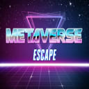
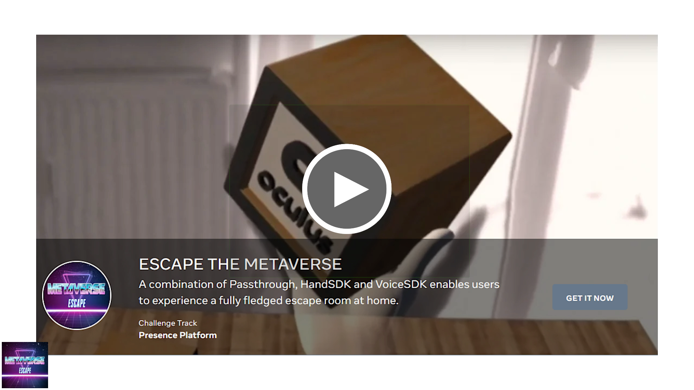

# Escape the Metaverse
> A combination of Passthrough, HandSDK and VoiceSDK enables users to experience a fully fledged escape room at home.

VR-Escape rooms are fun, giving users the possibility to experience various settings, with countless possibilities to interact. BUT there are always things like furniture, space, etc... which prevent players from having a truly immersive experience at home. In addition, there is no guide helping you when you're stuck and when you're close to solving a hard riddle, the controller batteries run out.

With "Escape the Metaverse" we enable players to overcome the hindrances mentioned above. Passthrough prevents players from stumbling over furniture. VoiceSDK allows them to interact with a virtual guide and gives them a Jeopardy-like experience for answering questions. Using the HandSDK, we'll reach a new level of immersion and empty batteries in controllers belong to the past.

## Team

## Installation

Direct Installation from [APK](https://nextcloud.brew.at/index.php/s/QKXGaRkPzHzksKc/download?path=%2FFinal%20apk&files=escape-the-metaverse-final.apk) 

## Installation

* Open the project using Unity 2020.3.22f1
* In Build Settings switch to Android

## Gameplay mechanics

### Drawing virtual windows
For drawing virtual windows, press the right trigger once to start. Move the controler until you're satisfied with the size. Press the right trigger again, to confirm the placement and size.

### Drawing virtual environment
For drawing virtual environment, press the right trigger once to start. To confirm the initial size, press the right trigger again. The already defined environment model can be rotated with the right thumbstick. To confirm the desired height, press the right trigger again. When finished, press A on your right controller, to confirm the placement.

## Usage notes

* Make sure that a roomscale guardian is placed. Room mapping doesn't work with seated guardian.
* Sometimes the VoiceSDK doesn't connect to the voice server immediately. Just try to switch it on and of a few times, to make sure it works.
* Please note that the assets included in this project, may NOT be used for other purposes! People forking this repository are not eligible to use them in other projects.

Used assets:
[Demon Dog](https://assetstore.unity.com/packages/3d/characters/creatures/demon-dog-122346)
[POLYGON Knights](https://assetstore.unity.com/packages/3d/environments/fantasy/polygon-knights-low-poly-3d-art-by-synty-83694)
[POLYGON Particle FX](https://assetstore.unity.com/packages/vfx/particles/polygon-particle-fx-low-poly-3d-art-by-synty-168372)
[POLYGON City](https://assetstore.unity.com/packages/3d/environments/urban/polygon-city-low-poly-3d-art-by-synty-95214)

## Release History

* 1.0.0
    * Submission build for Facebook xr2021 Hackathon

## Meta

Andreas Braumann, Markus Altenhofer, Vlad Tormoz

Distributed under the MIT license.

[https://github.com/brewmanandi/fb-xr-hackathong](https://github.com/brewmanandi/fb-xr-hackathong/)
